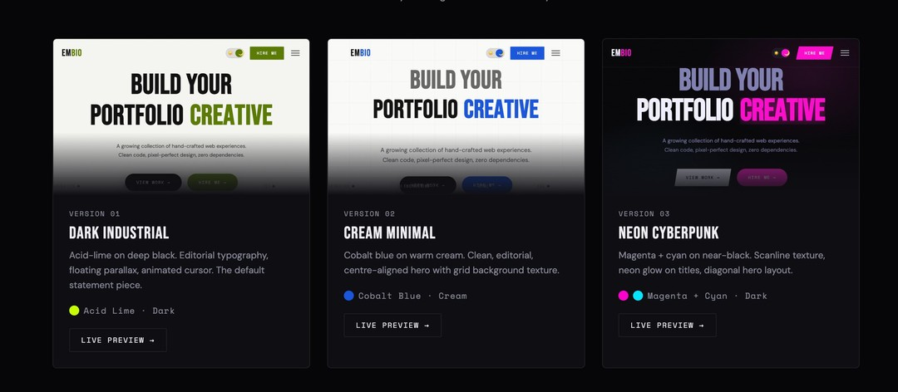
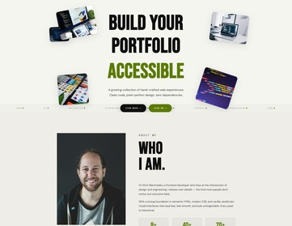
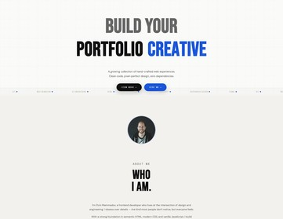
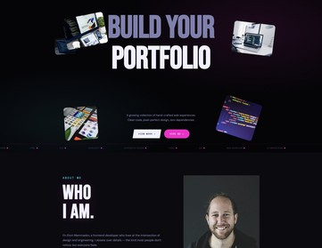

# 🎨 EMBio - Portfolio Template

A modern, dark-first, editorial-style portfolio template for frontend developers. Zero dependencies, pure HTML/CSS/JS with full SCSS support.


## ✨ Features

- 🎭 **3 Unique Visual Styles** - Dark Industrial, Cream Minimal, Neon Cyberpunk
- 🌓 **Light/Dark Mode** - Built-in theme toggle for all versions
- 📱 **Fully Responsive** - Mobile-first design, works on all devices
- 🎨 **SCSS Architecture** - Modular, maintainable stylesheet structure
- ⚡ **Zero Dependencies** - No frameworks, no build step required (optional SCSS compilation)
- 🧩 **Modular Components** - Reusable, well-organized code
- ✅ **W3C Valid** - Clean, semantic HTML
- 🚀 **Performance Optimized** - Lightweight and fast
- 📖 **Well Documented** - Comprehensive guides in multiple languages

## 🎯 Demo

[Live Preview](https://your-demo-url.com) (Replace with your actual demo URL)

## 🖼️ Versions

### Version 1: Dark Industrial
- Acid-lime accent (#c8ff00) on deep black
- Editorial typography with Bebas Neue
- Floating parallax elements
- Custom animated cursor

### Version 2: Cream Minimal
- Cobalt blue accent (#1a56db) on warm cream
- Clean, center-aligned hero section
- Grid background texture
- Minimalist design approach

### Version 3: Neon Cyberpunk
- Magenta (#ff00cc) + Cyan (#00e5ff) dual accents
- Scanline texture effect
- Neon glow on titles
- Diagonal hero layout

## 🚀 Quick Start

### Standard Usage (CSS Only)

1. **Download and extract** the template
2. **Open** `index.html`, `v2.html`, or `v3.html` in your browser
3. **Customize** the HTML and CSS files
4. **Deploy** to your hosting

No build process needed!

### SCSS Development

1. **Install dependencies:**
   ```bash
   cd embio
   npm install
   ```

2. **Compile SCSS:**
   ```bash
   # Compile all versions
   npm run compile:all
   
   # Or compile individually
   npm run compile:v1
   npm run compile:v2
   npm run compile:v3
   ```

3. **Development mode (watch):**
   ```bash
   npm run dev:v1
   npm run dev:v2
   npm run dev:v3
   ```

## 📁 Project Structure

```
embio/
├── index.html              # Version 1 (Dark Industrial)
├── v2.html                # Version 2 (Cream Minimal)
├── v3.html                # Version 3 (Neon Cyberpunk)
├── preview.html           # All versions preview page
├── scss-test.html         # SCSS compilation guide
├── assets/
│   ├── css/              # Compiled CSS files
│   │   ├── style.css
│   │   ├── style-v2.css
│   │   └── style-v3.css
│   ├── scss/             # SCSS source files (NEW!)
│   │   ├── _variables.scss
│   │   ├── _mixins.scss
│   │   ├── v1/
│   │   ├── v2/
│   │   └── v3/
│   ├── js/               # JavaScript modules
│   └── images/           # Image assets
├── documentation/        # Full documentation
├── package.json         # NPM configuration
├── SCSS_GUIDE.md       # SCSS usage guide (Azerbaijani)
├── CHANGELOG.md        # Version history
└── README.md           # This file
```

## 🎨 SCSS Features

### Global Variables
```scss
// Colors
$accent: #c8ff00;
$bg: #080808;
$text: #e8e8e8;

// Typography
$font-display: 'Bebas Neue', sans-serif;
$font-body: 'DM Sans', sans-serif;
$font-mono: 'Space Mono', monospace;
```

### Responsive Mixins
```scss
@include mobile {
  // Styles for screens < 600px
}

@include tablet {
  // Styles for screens < 900px
}

@include desktop {
  // Styles for screens > 901px
}
```

### Utility Mixins
```scss
@include flex-center;      // Center with flexbox
@include transition($props); // Smooth transitions
@include hover-lift;       // Hover elevation effect
@include section-spacing;  // Consistent padding
```

## 📝 Customization

### Change Colors

Edit `assets/scss/_variables.scss`:
```scss
$accent: #00ff00;  // Change to green
$bg: #1a1a1a;     // Lighter background
```

Then compile:
```bash
npm run compile:v1
```

### Add New Section

1. Create SCSS file:
   ```scss
   // assets/scss/v1/sections/_new-section.scss
   @import '../../variables';
   @import '../../mixins';
   
   .new-section {
     padding: 8rem 2rem;
     
     @include mobile {
       padding: 4rem 1.5rem;
     }
   }
   ```

2. Import in main file:
   ```scss
   // assets/scss/v1/style.scss
   @import 'sections/new-section';
   ```

3. Compile:
   ```bash
   npm run compile:v1
   ```

## 🛠️ Tech Stack

- **HTML5** - Semantic markup
- **CSS3** - Modern styling with custom properties
- **SCSS** - Enhanced CSS with variables, nesting, mixins
- **JavaScript (Vanilla)** - No frameworks
- **Fonts:**
  - Bebas Neue (Display)
  - DM Sans (Body)
  - Space Mono (Monospace)

## 📦 NPM Scripts

| Command | Description |
|---------|-------------|
| `npm install` | Install dependencies |
| `npm run compile:all` | Compile all SCSS versions |
| `npm run compile:v1` | Compile Version 1 only |
| `npm run compile:v2` | Compile Version 2 only |
| `npm run compile:v3` | Compile Version 3 only |
| `npm run dev:v1` | Watch mode for V1 |
| `npm run dev:v2` | Watch mode for V2 |
| `npm run dev:v3` | Watch mode for V3 |

## 📚 Documentation

- **SCSS_GUIDE.md** - Complete SCSS guide (Azerbaijani)
- **assets/scss/README.md** - SCSS structure overview
- **CHANGELOG.md** - Version history and updates
- **documentation/index.html** - Full HTML documentation

## 🌐 Browser Support

- ✅ Chrome (latest)
- ✅ Firefox (latest)
- ✅ Safari (latest)
- ✅ Edge (latest)
- ✅ Mobile browsers

## 📄 License

MIT License - feel free to use for personal and commercial projects.

## 🤝 Contributing

Contributions, issues, and feature requests are welcome!

## 👨‍💻 Author

**Elvin Mammadov**

## 🌟 Show Your Support

Give a ⭐️ if this project helped you!

## 📸 Screenshots

### Preview Page


### Version 1 — Dark Industrial


### Version 2 — Cream Minimal


### Version 3 — Neon Cyberpunk


## 🔄 Version History

See [CHANGELOG.md](CHANGELOG.md) for detailed version history.

### v2.7.0 (Latest)
- ✅ Added `upload/` folder for ThemeForest submission
- ✅ Merged all SCSS overrides into single `_overrides.scss`
- ✅ Removed separate `v1/` SCSS subfolder — flat structure
- ✅ CSS: removed separate `style-v2.css` / `style-v3.css` files
- ✅ Skills expanded from 6 → 12 with unique linear SVG icons
- ✅ All emoji replaced with professional inline SVG icons
- ✅ `screenshots/` folder added — GitHub README images fixed

### v1.0.0
- 🎉 Initial release
- 3 unique versions (Dark Industrial, Cream Minimal, Neon Cyberpunk)
- Light/Dark mode toggle
- Fully responsive design

---

Made with ❤️ for the frontend community
